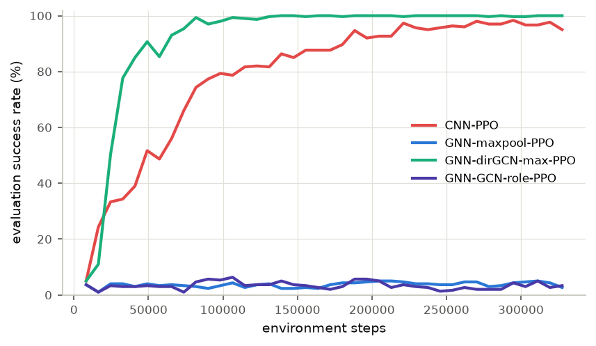

# Topology-Aware Graph Representation for Deep Reinforcement Learning-Based Routing on MEDA Biochips

This is the project's methodology document. The supervisor's correction is
applied: neighbouring edges use **8 directions** (left, right, up, down and
the four diagonals) instead of 4, which matches the 8-direction action space.
Section 13 maps every part to the code, and section 14 records findings from
implementing it.

## 1. Objective

Extend the reproduced Elfar et al. (2023) CNN–PPO MEDA droplet-routing
approach by replacing the CNN state encoder with a Graph Neural Network
(GNN). The initial graph readout is **global max pooling**. This is a
provisional choice to evaluate, not an assumed optimal solution.

**Source distinction:** CNN–PPO and the routing environment are the
reproduced baseline. Graph construction, GNN encoding and max pooling are
proposed methodology. They are not part of the original paper. In the code,
these parts are tagged `[METHOD-DOC]`, as opposed to `[PAPER]`, `[REF-CODE]`
and `[ASSUMED]`.

## 2. Pipeline

**Baseline:** MEDA grid observation → CNN → feature maps → Flatten → PPO
actor–critic → movement action.

**Proposed:** MEDA grid observation → graph construction → GNN message
passing → global max pooling → graph embedding → PPO actor–critic →
movement action.

The controlled change is the state encoder and readout. Environment
semantics stay fixed.

## 3. Changed vs. unchanged

| Component | Baseline | Proposed |
|---|---|---|
| Chip representation | 2D grid | Graph: one node per MC |
| State encoder | CNN | GNN |
| Spatial structure | Convolutional locality | Explicit **8-directional** adjacency |
| Encoder output | CNN maps flattened to a vector | Node embeddings max-pooled to a graph vector |
| PPO input | CNN feature vector | Graph embedding |
| Observation features | MC health, droplet location, goal location | The same three features on nodes |
| Simulator, degradation and stochastic movement | Existing implementation | Unchanged |
| Action space | N, S, E, W, NE, NW, SE, SW | Unchanged |
| Reward and termination | Existing implementation | Unchanged initially |
| PPO algorithm and settings | Baseline configuration | Unchanged initially |
| Evaluation protocol | Baseline protocol | Matched |

## 4. Graph construction

The chip is represented as `G = (V, E, X)`.

- **V (nodes):** one node per MC.
- **E (edges):** spatial adjacency between MCs in 8 directions: left,
  right, up, down, up-left, up-right, down-left and down-right.
- **X (node-feature matrix):** the same three observation features the
  baseline uses.

For a `W × H` chip, `N = W × H` and `X ∈ R^(N × 3)`. The mapping from grid
coordinate `(x, y)` to node index is deterministic: `node(x, y) = y·W + x`.
This is the row-major order of the observation `(3, rows = y, cols = x)`.

### Node features

| Feature | Meaning |
|---|---|
| MC health | Same normalized health value as the baseline observation: `H / 2^b` inside the routing zone, 0 outside |
| Droplet location | Same indicator as the baseline: 1 on the droplet's MCs |
| Goal location | Same indicator as the baseline: 1 on the goal's MCs |

Node features are copied from the baseline's observation tensor without any
change to normalization. `validate_graph` checks this exactly.

### Edges and attributes

- Edges connect only valid 8-neighbour MCs, so corner nodes have 3
  neighbours, edge nodes 5 and interior nodes 8.
- Edges are stored in both directions, so messages flow both ways.
- **Initial edge attributes: none.** An edge only indicates adjacency.
- Health-dependent stochastic movement probabilities stay in the simulator.
  They are not edge attributes in this first version.
- A degraded MC remains a node, carrying its health feature. It is not
  removed.

## 5. GNN and readout

### Message passing

A GNN updates each node embedding by aggregating information from
neighbouring nodes. First configuration, recorded in the config:
- Layer: GCN (Kipf & Welling), `H' = ReLU(D^-1/2 (A + I) D^-1/2 H W + b)` on
  the 8-neighbour graph.
- 3 layers.
- Hidden dimension 64.

### Global max pooling

After message passing, the node-embedding matrix is `Z ∈ R^(N × d)`. Global
max pooling computes `g[k] = max_i Z[i,k]`, a fixed-size graph embedding
`g ∈ R^d`. It keeps the strongest activation per dimension and does not
depend on node order. It may lose the exact position and role of the droplet
and goal, which is treated as a hypothesis to evaluate (section 14).

### PPO actor–critic

- **Actor:** maps `g` to probabilities over the same 8 movement actions.
- **Critic:** maps `g` to the scalar state value `V(s)`.

Both are linear heads on `g`, as in the baseline, where they sit on the CNN
features. PPO remains the RL algorithm.

## 6. Implementation workflow

1. Freeze the CNN baseline: code revision, config, checkpoint, seeds and
   evaluation jobs.
2. Implement graph conversion from each existing observation.
3. Validate node count, adjacency, coordinate mapping and feature parity with
   the grid.
4. Implement GNN message passing and node embeddings.
5. Apply global max pooling to produce one graph embedding.
6. Connect the embedding to the PPO actor and critic, keeping the action
   space.
7. Smoke-test shapes, finite outputs, the action distribution, environment
   stepping, save/load and inference.
8. Train with simulator, reward, PPO settings, budget and protocol matched as
   closely as possible.
9. Evaluate CNN and GNN on the same held-out jobs and matched seeds.
10. After the first comparison, run readout ablations (e.g. max vs. a
    role-aware readout), changing one factor at a time.

## 7. Metrics

The same definitions apply to CNN–PPO and GNN–PPO:

| Metric | Definition in this code |
|---|---|
| Success rate (%) | Fraction of evaluation jobs that reach the goal |
| Mean routing cycles | Average over **all** jobs, with a timed-out job counted at `k_max`. `mean_cycles_successful_jobs` averages successful jobs only |
| Median routing cycles | Same denominator as the mean |
| Std. of cycles | Same denominator |
| Failure rate (%) | 1 − success rate; every failure is a timeout at `k_max` |
| Invalid-action rate | Invalid actions per decision, from the environment's `invalid_action` flag |
| Training environment steps | `timesteps` in `progress.csv` |
| PPO optimizer updates | `ppo_updates` (training phases) and `optimizer_steps` (gradient steps) |
| Convergence point | First evaluation after which success stays ≥ 95% for 3 consecutive epochs, in environment steps and optimizer steps. Empty if never reached |
| Wall-clock training time | `elapsed_seconds` |
| Inference time | Mean time of one `model.predict` call on a single observation (one decision), with the device stated |

Undefined metrics, such as cycles of successful jobs when no job succeeds,
are written as empty or null, never as 0.

## 8. Tables and output artifacts

`meda compare-methods` writes these files:

| File | Content |
|---|---|
| `results/tables/experiment_config.csv` | method, seed, graph_node_features, graph_connectivity, edge_attributes, gnn_type, gnn_hidden_dim, gnn_num_layers, pooling, PPO config, total_env_steps, evaluation_protocol |
| `results/tables/main_comparison.csv` | one row per method: success, mean/median/std cycles, failure, invalid actions, steps to convergence, train time, inference time (mean ± std over seeds) |
| `results/tables/per_seed_results.csv` | the same metrics for each seed |
| `results/tables/graph_validation.csv` | node count, feature dimension, 8-neighbour edges, both directions, degrees, coordinate mapping, feature parity, batched shapes |
| `results/logs/training_metrics.csv` | one row per method/seed/epoch: env steps, PPO updates, optimizer steps, train and eval success, mean/median cycles, learning rate, elapsed time |
| `results/logs/evaluation_jobs.csv` | one row per method/seed/job/repeat: job ID, success, cycles, termination reason, invalid actions, score. Job IDs are identical for every method |
| `results/figures/` | success rate and mean cycles vs. environment steps (mean and min–max band over seeds), training success rate, per-job cycles of the two methods |

## 9. Repository structure (as implemented)

The existing repository is kept. Graph-specific modules were added with
minimal disruption:

| Suggested | Implemented as |
|---|---|
| `src/representations/graph_builder.py` | `src/meda_routing/representations/graph_builder.py` |
| `src/models/gnn_encoder.py`, `graph_readout.py` | `src/meda_routing/agents/gnn.py`, `agents/graph_readout.py` |
| `src/models/cnn_extractor.py` | `src/meda_routing/agents/cnn.py` (baseline) |
| `src/algorithms/ppo_runner.py`, `training/train_*.py` | `src/meda_routing/training/trainer.py` (one trainer; the encoder is chosen in the config) |
| `src/evaluation/*` | `training/evaluation.py`, `experiments/method_comparison.py` |
| `configs/cnn_baseline.yaml`, `gnn_maxpool.yaml` | `configs/training/paper_30x30_healthy.yaml`, `gnn_maxpool_30x30.yaml` (and the 16×16 CPU pair `validation_16x16.yaml` / `gnn_maxpool_16x16.yaml`) |
| `scripts/run_*.sh` | `scripts/run_gnn_experiment.sh` |
| `checkpoints/`, `runs/` | `runs/<name>/seed_<s>/` (model, `checkpoints/`, logs, plots) |
| `results/` | `results/` (written by `meda compare-methods`) |
| `tests/test_graph_builder.py`, `test_graph_readout.py`, `test_policy_shapes.py` | same names; baseline consistency is tested in `test_policy_shapes.py` |

## 10. Controls and caveats

- Health-dependent stochastic movement and all environment semantics are
  unchanged. The GNN configs inherit every baseline setting via `base:`, and
  a test asserts that only the encoder differs.
- Reward, action space, termination, PPO settings and evaluation jobs are
  fixed for the first comparison.
- Reproduction assumptions are documented (`docs/IMPLEMENTATION_NOTES.md`,
  and a source tag on every parameter). Settings the paper does not specify
  are not presented as paper parameters.
- Compare using environment steps, optimizer updates and wall-clock time,
  not epoch count alone.
- Use several seeds where feasible (`--set repeats=5`, as the paper does).
  Configs and checkpoints are saved with every run.
- Max pooling is the first readout to test, not a final claim.

## 11. Technical terms

| Term | Meaning |
|---|---|
| MEDA | Micro-Electrode-Dot-Array biochip |
| MC | Micro-electrode cell |
| State / observation | MC health, droplet location and goal location at a decision step |
| Node | One MC in the graph |
| Edge | Connection between spatially adjacent MCs (8 directions) |
| Node features | Values attached to each node |
| Message passing | GNN exchange and aggregation of neighbour information |
| Node embedding | Learned vector for an MC, informed by its neighbourhood |
| Graph readout | Converts node embeddings into a graph-level representation |
| Global max pooling | Element-wise maximum across node embeddings |
| GNN / CNN | Graph Neural Network / Convolutional Neural Network |
| PPO | Proximal Policy Optimization |
| Actor | Policy network producing action probabilities |
| Critic | Value network estimating expected return |
| `V(s)` | The critic's state-value estimate |
| Held-out evaluation | Evaluation on jobs excluded from training and model selection |
| Ablation study | Controlled change to one component to test its contribution |

## 12. First implementation milestone

| Check | Where it is verified |
|---|---|
| (1) every MC maps to one node | `test_graph_builder.py`, `graph_validation.csv` |
| (2) all three features match the baseline | exact element-wise parity, same tests |
| (3) edges encode valid 8-directional adjacency | exhaustive edge-set test for several chip sizes |
| (4) the GNN outputs the expected node-embedding shapes | `test_graph_readout.py` |
| (5) max pooling returns a fixed-size graph embedding | `test_graph_readout.py` |
| (6) the PPO actor and critic accept it and produce valid outputs | `test_policy_shapes.py`: 8 action probabilities, finite `V(s)`, training steps, save/load |

## 13. How to run

```bash
# the graph checks (writes results/tables/graph_validation.csv)
meda validate-graph -c configs/training/gnn_maxpool_30x30.yaml

# train the frozen baseline and the GNN with the same settings and seeds (GPU used if present)
meda train -c configs/training/paper_30x30_healthy.yaml --set repeats=5
meda train -c configs/training/gnn_maxpool_30x30.yaml   --set repeats=5

# compare on the same held-out jobs -> results/tables, results/logs, results/figures
meda compare-methods --method "CNN-PPO" runs/paper_30x30_healthy \
                     --method "GNN-maxpool-PPO" runs/gnn_maxpool_30x30

# or everything at once, optionally on the lab GPU server
GPU_SERVER=user@192.168.x.x bash scripts/run_on_gpu_server.sh bash scripts/run_gnn_experiment.sh
```

Ablations change one line each, for example
`--set agent.extractor_kwargs.pooling=role` or
`--set agent.extractor_kwargs.gnn_type=dir_gcn`. Pass a different `name`
with `--set name=...` so the runs don't overwrite each other.

## 14. Findings while implementing

- **Mirror symmetry of GCN + max pooling.** The GCN layer treats all 8
  neighbours alike (isotropic aggregation). With the three node features and
  a max-pooled readout, a job and its mirror image produce exactly the same
  graph embedding, and therefore the same action probabilities, even though
  their correct moves are opposite (east vs. west). Only the chip boundary
  breaks this symmetry. `tests/test_graph_readout.py` demonstrates it. This
  is the positional-information loss that section 10 anticipates, and it
  stems from the isotropic layer as well as from the readout. The first
  comparison is run exactly as specified. Two ablations are ready, each
  changing one factor:
  - `gnn_type: dir_gcn`: relational message passing with one weight matrix
    per neighbour direction. The direction comes from the graph geometry, so
    it adds no stored edge attributes.
  - `pooling: role`: the max pool concatenated with the mean embeddings of
    the droplet's nodes and of the goal's nodes.
- **Receptive field.** With 3 layers a node only sees MCs within 3 steps. In
  a job where the goal is farther than that from the droplet, no node
  embedding contains both.
- **Cost.** GCN aggregation is a sparse matrix product over the explicit edge
  list. On a 4-core CPU, the forward and backward pass for a batch of 32
  observations takes about 40 ms on 30×30 and about 10 ms on 16×16. The
  encoder has 8.6 k parameters, against 29.7 M for the Table I CNN.

## 15. First comparison and ablations (CPU-sized, 16×16, 1 seed)

All four methods were trained with the current code and identical settings:
- chips: healthy 16×16, native resolution;
- budget: 40 epochs of 2^13 steps (327,680 environment steps);
- PPO settings and seed 0 the same for all.

Each ablation changes exactly one factor of the GNN; a test enforces this.
All four were evaluated on the same 500 held-out jobs (seed 20000), using
`bash scripts/run_gnn_experiment.sh` with `SIZE=16 SEEDS=1 ABLATIONS=1`.
The files are in `results/`.

| Method | Changed factor | Success | Mean cycles (all jobs) | Invalid actions per decision | Env. steps to convergence¹ | Parameters | Train time² |
|---|---|---|---|---|---|---|---|
| CNN–PPO (baseline) | — | 96.2% | 5.94 | 0.12 | 221,200 | 2.15 M | 30 min |
| GCN + max pooling + PPO | encoder | 4.0% | 25.06 | 0.88 | never | 8.6 k | 21 min |
| **direction-aware GCN + max pooling + PPO** | layer: `dir_gcn` | **99.4%** | **4.89** | **0.004** | **73,730** | 76 k | 66 min |
| GCN + role-aware readout + PPO | readout: `role` | 5.0% | 24.83 | 0.89 | never | 10 k | 18 min |

¹ The first epoch after which evaluation success stays ≥ 95% for 3 evaluations.
² On a shared 4-core CPU, with two trainings running at a time.



**Findings**

- **The GCN layer was the problem, not max pooling.** Giving each of the 8
  neighbour directions its own weights, with no other change, takes the GNN
  from 4% to 99.4% success. The resulting agent uses fewer cycles than the
  CNN (4.89 vs. 5.94) and reaches the convergence criterion in a third of the
  environment steps (74 k vs. 221 k). It has 28× fewer parameters than this
  CNN, and about 390× fewer than the paper's Table I CNN.
- **A role-aware readout does not fix the isotropic GCN** (5.0%). Knowing
  which nodes are the droplet and the goal does not help when their
  embeddings carry no direction. This confirms the mirror-symmetry
  explanation of section 14.
- **Global max pooling works.** Once the layers encode direction, the plain
  max readout suffices, so the methodology's readout choice stands.
- On the same 500 jobs, the direction-aware GNN is faster than the CNN on
  188 jobs, slower on 32 and tied on 280
  (`results/figures/per_job_cycles_gnn_dirgcn_max_ppo.png`). It also solves
  most of the jobs where the CNN timed out.

**Caveats.** This is one seed on a reduced 16×16 problem with a CPU budget.
The direction-aware layer's weights depend on the direction of each edge,
which departs from "edges only indicate adjacency" (section 4), although it
stores no edge attributes. The next steps:
- run the 30×30 comparison with 5 seeds on a GPU:
  `SIZE=30 SEEDS=5 ABLATIONS=1 bash scripts/run_gnn_experiment.sh`;
- test transfer across chip sizes, which the GNN's size-independent weights
  make possible;
- test chips with injected faults.
